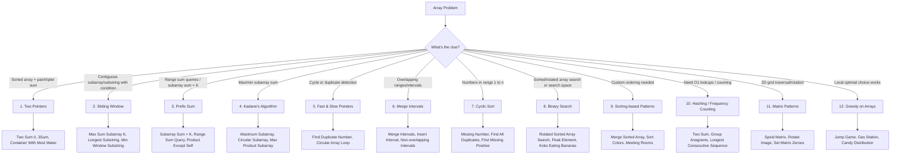

# 📊 Array Patterns Roadmap — DSA Preparation

A quick-reference guide + flowchart for the 12 most-asked array patterns in coding interviews.

---

## 🗺️ Pattern Flowchart



---

## 📚 Pattern Reference Table

| #   | Pattern                          | When to Use                                    | Example Problems                                                      |
| --- | -------------------------------- | ---------------------------------------------- | --------------------------------------------------------------------- |
| 1   | **Two Pointers**                 | Sorted array, pair/triplet sum                 | Two Sum II, 3Sum, Container With Most Water                           |
| 2   | **Sliding Window**               | Contiguous subarray/substring with a condition | Max Sum Subarray of Size K, Longest Substring Without Repeating Chars |
| 3   | **Prefix Sum**                   | Range sum queries, subarray sum = K            | Subarray Sum Equals K, Range Sum Query, Product of Array Except Self  |
| 4   | **Kadane's Algorithm**           | Max/min contiguous subarray sum                | Maximum Subarray, Maximum Circular Subarray Sum                       |
| 5   | **Fast & Slow Pointers**         | Cycle or duplicate detection                   | Find Duplicate Number, Circular Array Loop                            |
| 6   | **Merge Intervals**              | Overlapping ranges                             | Merge Intervals, Insert Interval                                      |
| 7   | **Cyclic Sort**                  | Numbers in range [1, n]                        | Find Missing Number, First Missing Positive                           |
| 8   | **Binary Search**                | Sorted/rotated array or search space problems  | Search in Rotated Sorted Array, Koko Eating Bananas                   |
| 9   | **Sorting-based**                | Custom order + greedy logic                    | Merge Sorted Array, Sort Colors, Meeting Rooms                        |
| 10  | **Hashing / Frequency Counting** | Need O(1) lookups, avoid nested loops          | Two Sum, Group Anagrams, Longest Consecutive Sequence                 |
| 11  | **Matrix Patterns**              | 2D array traversal/rotation                    | Spiral Matrix, Rotate Image, Set Matrix Zeroes                        |
| 12  | **Greedy on Arrays**             | Local optimal choice → global optimum          | Jump Game, Gas Station, Candy Distribution                            |

---

## ✅ Suggested Practice Order

```
Two Pointers → Sliding Window → Prefix Sum → Kadane's Algorithm
→ Hashing → Sorting-based → Cyclic Sort → Binary Search
→ Merge Intervals → Matrix Patterns → Greedy → Fast/Slow Pointers
```

**Tip:** Solve 3–5 problems (easy → medium → hard) per pattern before moving on.

---

## 📝 Progress Tracker

- [ ] Two Pointers
- [ ] Sliding Window
- [ ] Prefix Sum
- [ ] Kadane's Algorithm
- [ ] Fast & Slow Pointers
- [ ] Merge Intervals
- [ ] Cyclic Sort
- [ ] Binary Search
- [ ] Sorting-based Patterns
- [ ] Hashing / Frequency Counting
- [ ] Matrix Patterns
- [ ] Greedy on Arrays

---

_Last updated: keep this file in your DSA repo and check off patterns as you master them!_
